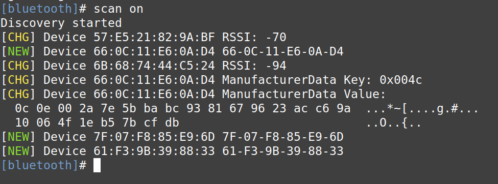
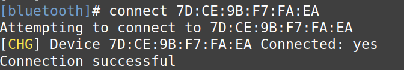

# Banzer

Banzer is a small vehicle built as a project for UNI. It is operated by a Raspberry Pi 3 Model B+ from 2017.

## Features

- **Badass:** Banzer has a cool and impressive design.
- **Fast:** It can move quickly and efficiently.
- **Smart:** It uses advanced technology to perform tasks.
- **Etc:** There are many other great features that Banzer offers.


## **Disclaimer** 
* Until further notice this software is still in development.
* The following is the dokumentation of the effort to create a **Voice command controlled Vehicle** its messy not optimal and prone to crash.
* This project may or may not be finished 
* This documentation is intended for individuals with little or no prior knowledge of Linux. Its purpose is to serve as an educational resource for beginners who wish to build their own Robot.

## Required Hardware
- **RaspberryPi** 
- **Ps4 wirless controller**
- **Other ...**

## Dependencies
Banzer requires the the following libraries/Packages:


- **RSi.GPIO:** pre-installed in the PI_OS

- **pyPS4controller:** This Module is downloaded from the [Python Package index Webpage Pypi.org](https://pypi.org/project/pyPS4Controller/)

- **TensorFlow:** This library can be downloaded from the official [Pytorch webpage](https://pytorch.org/).


## Installation
OS : [Raspbian](https://www.raspbian.org/) version_unkown

[Python](https://www.python.org/) : 3.8

[C/C++](https://gcc.gnu.org/onlinedocs/libstdc++/) : std=c++11 

### Board Setup
* This setup assume the existance of an Updated OS running on the Pi board as well as all the above mentioned Packages. 
[Dependencies](#Dependencies)

To download and install an OS pls visit the [Raspberrypi webpage](https://www.raspberrypi.com/documentation/computers/getting-started.html)

* To update the OS run the following
```bash
$ sudo apt update
$ sudo apt upgrade 
```

* To easly install the Python packages directly on the Pi,u need to update Pythons own packet manager Pip.To do so run.
```bash
$ pip install --upgrade pip
``` 
For early Python versions run pip3 instead of pip 
* To apply the changes reboot the device using 
```bash
$ sudo reboot
```
### Ps4 Controller
* To connect the Ps4 controller first we need to open the bluetooth configuration tool.
Open a Terminal and run

```bash
$ sudo bluetoothctl
```
Next run the following commands once at a time
```bash
$ agent on 
$ default-agent
```
The bluetooth configuration tool should be running on the terminal.
* To connect the controller,first we need to detect it and find its [MAC address](https://en.wikipedia.org/wiki/MAC_address).
To do so run 
```bash
$ scan on
```
Now u need to simultaniously press the share and Ps button till the back light of the controller starts to blink.


And somthing like the following appear on ur console.


* The Controller is Labled as **Device** followed by its MAC adress in the format **XX : XX : XX : XX : XX : XX** followed by the Device name,in the Ps4 controller case **Wirless Controller**.
Copie the device Mac adress then run 
```bash
$ trust UR_DEVICE_MAC_ADRESS
$ pair UR_DEVICE_MAC_ADRESS
$ connect UR_DEVICE_MAC_ADRESS
```
If the connection is successful smt like the following will appear 


## Usage
Have fun (dnt mind me)

## Configuration

### Instructions 
To make the Pi run the driver 'program' at boot we used a bash script for compiling/building and runing the Program excutable to automate the process then created a linux service to run the command at boot.


To create the linux service do the following:\
Go to the folder located at

```bash
/etc/systemd/system/
```

Create a foo.service file and open it for edit.


If ur programming on the Pi just run:

```bash
$ sudo nano /etc/systemd/system/foo.service
```
Replace foo with an appropriate task name.

Next copy the following code to ur foo.service file 

```markdown
[Unit]
Description=driver

[Service]
ExecStart=/home/user/path/to/my/driver
Restart=on-failure
Restartsec=30s
User=root

[Install]
WantedBy=multi-user.target
```
After saving the changes and exiting the nano text editor run the following command to apply the changes to the service manager.

```bash
$ sudo systemctl daemon-reload
```
To enable the service to run at boot run 

```bash
$ sudo systemctl enable foo.service
```
To make sure the file has the correct permission to run at boot run

```bash
$ sudo chmod 644 /etc/systemd/system/foo.service
```

Then
```bash
$ sudo chown root:root /etc/systemd/system/foo.service
```


## License
Published under the **MIT License**


## Contact
We are always happy to chat about our project and answer any questions you may have. Please feel free to reach out.

[E-mail](dhia1.messaoudi@st.oth-regensbug.de)
